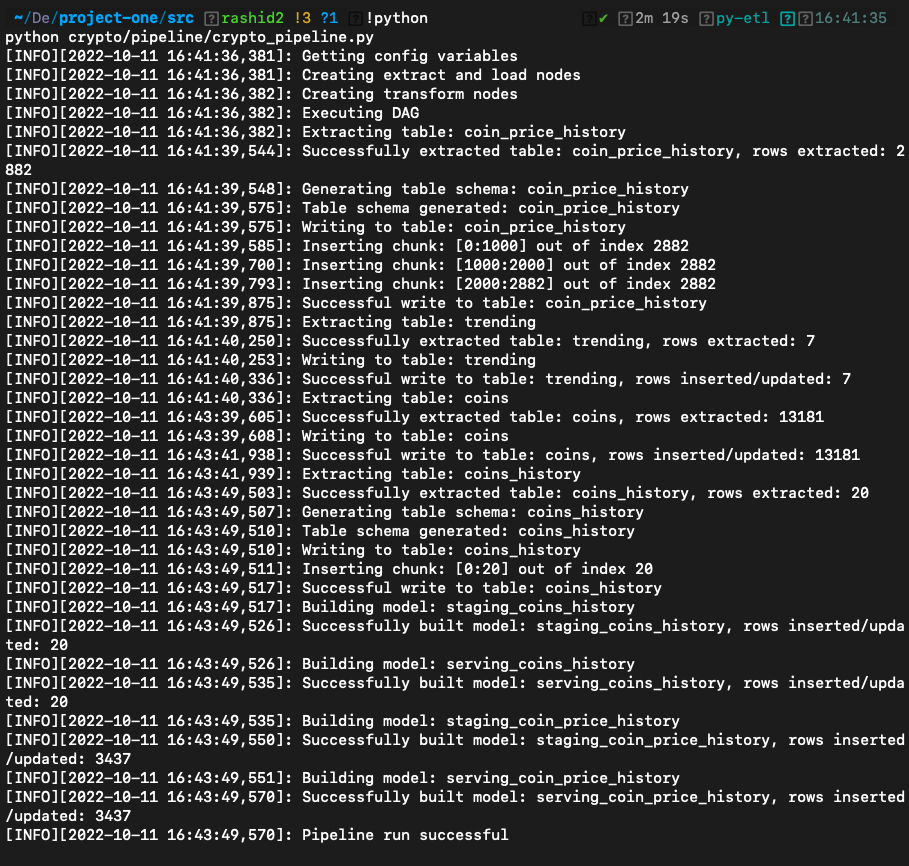

# Crypto Currency ETL Pipeline</title>

<br/>


# Introduction

A cryptocurrency is an implementation of blockchain technlogy that allows transactions to be verified cryptographically by nodes on a decentralised network. It is the medium of exchange on a computer network that operates without a central authority. The goal of this project is design and build a simple pipeline that provides high quality and tested data for further analysis. This is especially useful for investors in the crypto markets.

This project is not a data analysis project however there are some basic questions that have piqued our interests. There are as follows:

- What crypotocurrency has the highest change in trading price on a daily basis?
- What cryptocurrency has the highest and lowest market capitalisation?


<br/>

# Datasources 

The data sources considered during the design stage of pipeline development are provided in *Table 1* below. Upon careful consideration of each option, CoinGecko was selected because of its ease of use and detailed documentation.

| Data Source | Useful Documentation                                                | 
|-------------|-------------------------------------------------------------------- | 
| Alpaca      | https://alpaca.markets/learn/getting-started-with-alpaca-crypto-api | 
| CoinAPI     | https://www.coinapi.io/                                             |
| CoinGecko   | https://www.coingecko.com/api/documentations/v3                     |

<br/>


# Folder Structure 

```text

├── project-one
	├── Dockerfile
	├── ERD.png 
	├── README.md
	├── src/
		├── crypto/
		├── database/
		├── utility/
		├── requirements.txt
		├── set_python_path.bat 
		├── set_python_path.sh 


```


<br/>


# Run the pipeline

Please follow the steps below to successfully trigger the pipeline.

1. The `requirements.txt` file in the `src/` directory contains all the necessary python libraries to run the pipeline. Use the command below to install these dependencies.

```bash 

pip install -r requirements.txt

```

<br/>

2. Set the `PYTHONPATH` for the project using the command below. Use `set_python_path.bat` for windows.

```bash 
# navigate to the src directory
cd src 

# set the python path
. ./set_python_path.sh
```

<br/>

3. The pipeline extracts data from the CoinGecko API and persists the data in a PostgreSQL database thus, a PostgreSQL database called `crypto` has to be created. Modify the database connection variables found in `src/crypto/config.template.sh`. Use `config.bat` for windows.


<br/>

4. The pipeline can now be tested by navigating to the `src/` directory and running the command below 

```bash 
# E2E test
pytest
```


5. The pipeline can be manually triggered by using the following command

```bash 

python crypto/pipeline/crypto_pipeline.py

```




<br/>


# Entity Population and ETL 

The entites discussed in this section are created following a successful pipeline run.

<br/>

## ERD


<br/>

## Extract & Load

### 1. Coins table:
- Description: This table contains list of available coins using CoinGecko with only three columns required ('id','name','symbol').
- Type: Full , this means it will be fully extracted every time we run the code and will be loaded fully into the crypto database
- How it's getting extracted : In order to get a list of available coins using CoinGecko, the following needs to be done:

```python
cg.get_coins_list()
```

So to extract coins table required for this project here is the code has been use:

```python
df = pd.DataFrame(cg.get_coins_list(), columns=['id','name','symbol'])
```


### 2. Trending table:
- Description: This table contains list of top 7 trends for the day.
- Type: Full , this means it will be fully extracted every time we run the code and will be loaded fully into the crypto database
- How it's getting extracted : The following can be used to obtain the trending coins using CoinGecko:

```python
cg.get_search_trending()
```

In this project, trending data has been extracted using below code, and then unnecessary columns are droped.

```python
trend = cg.get_search_trending()
```

### 3. Coins_history table:
- Description: This table contains historical daily data (price , marketcap) for this list of coins ('bitcoin','litecoin','ethereum','solana' ,'umee','terra-luna','evmos','dejitaru-tsuka','reserve-rights-token','insights-network')
<br>
- Type: incremental, means it extracts data since the last day and upsert it into the correspondant table in crypto database
- How it's getting extracted : In this project, coins_history data has been extracted using below code, and then unnecessary columns are droped.

```python
data = cg.get_coin_history_by_id(id=coin,date=date_variable, localization='false')
```

### 4. Coin_price_history table:
- Description: This table contains historical market data include price, market cap, and 24h volume. Data granularity is automatic  and cannot be adjusted.
- Type: incremental, it extracts 1 day from current time = 5 minute interval data
- How it's getting extracted : In this project, coin_price_history data has been extracted using below code. It loops through thist list of coins('bitcoin','litecoin','ethereum','solana' ,'umee','terra-luna','evmos','dejitaru-tsuka','reserve-rights-token','insights-network') and concatinate the data of each coin to to bottoim of the dataframe.

```python
price_date = cg.get_coin_market_chart_by_id(id=coin,vs_currency='usd',days=number_of_days)
```


<br/>

## Transformations and Manipulations

The scripts used for data manipulation/transformation can be found in `crypto/models/transform`.


### Transformations
1. The `price_date` column of the `coins_history` table was renamed to `price_extraction_date` in the staging layer. 
2. The `current_price` column of the `staging_coins_history` table was rounded to two decimal places in the serving layer. 
3. The `market_cap` column of the `staging_coins_history` table was rounded to two decimal places in the serving layer. 
4. The `Price` column of the `coin_price_history` table was rounded to two decimal places in the staging layer.
5. A new column called `percent_increase` was added to the `staging_coin_price_history` table in the serving layer. 


<br/>

### Manipulations 
Anoop, I think you're the best person to describe the data stored in `serving_coins_greater_than_1_USD_latest_price.sql` data manipulation.


